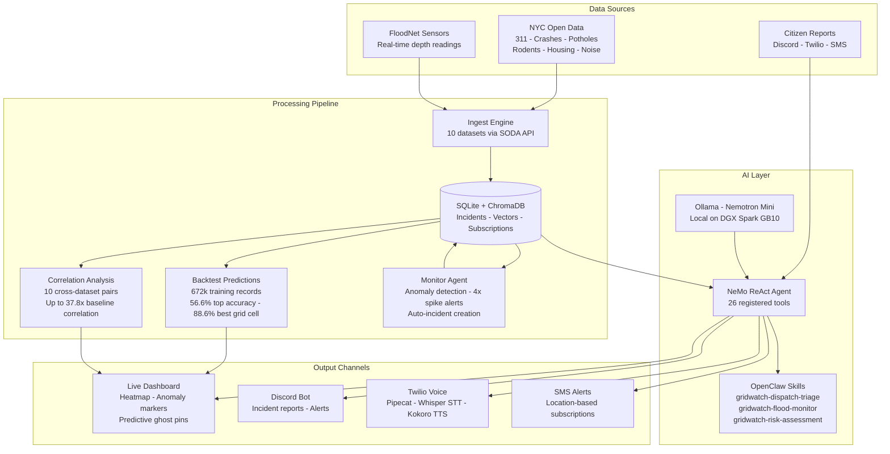

# GridWatch

AI-powered urban intelligence and dispatch platform for New York City. Multi-agent system with live data feeds, predictive analytics, citizen reporting (phone/SMS/Discord), and RAG-powered dispatch chat — all running on-device with NVIDIA Nemotron via the GB10 Grace Blackwell Superchip.

Built for **Spark Hack NYC 2026** (April 10-12, 2026).

---

## Technical Depth

| Component | What It Does |
|---|---|
| **Correlation Analysis** (10 datasets, haversine distance, random baseline comparison) | Real data science — discovers hidden links like rodents + housing violations correlating at 37.8x baseline |
| **Backtest Predictions** (672k training records, 158k test records, grid-based model) | ML pipeline with validation — 56.6% top-category accuracy, 88.6% best grid cell |
| **Monitor Agent** (cross-references FloodNet + 311, anomaly detection, auto-incident creation) | Autonomous agent loop — detects 4x spikes per ZIP, creates incidents without human input |
| **26-Tool NeMo ReAct Agent** | Complex tool orchestration — agent reasons over flood, 311, geo, and CRM tools in a loop |
| **Pipecat Voice Pipeline** (Whisper STT → Nemotron LLM → Kokoro TTS) | Multi-modal — residents call in, AI answers, creates incidents from speech |
| **OpenClaw Skills** (4 custom: dispatch-triage, flood-monitor, risk-assessment, nyc-dispatch) | Multi-agent / skill architecture — inbound from any channel via OpenClaw |
| **Multi-Channel I/O** (Discord bot, Twilio voice, SMS alerts, dashboard chat) | System integration — one platform, every input/output channel |
## Architecture




## Architecture


---

## Stack

| Layer | Technology |
|---|---|
| Frontend | Mapbox GL JS + deck.gl, port 8080 |
| Backend | FastAPI (Python), port 8000 |
| Database | SQLite |
| Vector DB | ChromaDB (1,800 docs, 6 collections) |
| AI Model | NVIDIA Nemotron-Mini 4.2B via Ollama (on-device) |
| Agent Skills | OpenClaw SKILL.md format |
| Hardware | NVIDIA GB10 Grace Blackwell (Acer Veriton GN100) |
| Voice/SMS | Twilio + Whisper |
| Chat Bot | Discord.py |
| Tunnel | ngrok |

---

## Quick Start

### Running on NVIDIA GB10 (Acer GN100 / DGX Spark)

**1. Ollama**
```bash
ollama serve
ollama pull nemotron-mini
```

**2. Backend**
```bash
cd hackathon-nyc-v11
pip3 install fastapi uvicorn aiohttp chromadb pydantic requests beautifulsoup4 pyyaml --break-system-packages
PYTHONPATH=src uvicorn hackathon_nyc.server:app --host 0.0.0.0 --port 8000
```

**3. Frontend** (separate terminal)
```bash
cd hackathon-nyc-v11/src/hackathon_nyc/frontend
python3 -m http.server 8080 --bind 0.0.0.0
```

**4. Discord Bot** (separate terminal)
```bash
cd hackathon-nyc-v11
export DISCORD_TOKEN=your_token_here
PYTHONPATH=src python3 -m hackathon_nyc.discord_bot
```

**5. ngrok** (for Twilio phone/SMS)
```bash
ngrok http 8000
# Copy the https URL into Twilio webhook settings
```

Open `http://DEVICE_IP:8080` from any browser on your network.

---

### Environment Variables

```bash
export DISCORD_TOKEN=your_discord_bot_token
export TWILIO_ACCOUNT_SID=your_twilio_sid
export TWILIO_AUTH_TOKEN=your_twilio_auth_token
export TWILIO_PHONE_NUMBER=+1234567890
```

Set your Mapbox token in `src/hackathon_nyc/frontend/index.html` (line 808).

---

## Features

### 3D Map
Interactive Mapbox GL map with 3D building extrusions. Buildings change color based on nearby incident type — blue for flooding, brown for rodents, purple for noise, red for heat violations. Tilted perspective with smooth camera transitions.

### Data Layers
Each layer button loads live data from NYC Open Data APIs:

| Layer | Source | What it shows |
|---|---|---|
| Incidents | Dispatch CRM + 311 | Noise (floating music notes), rodents (scurrying rats), flooding (water puddles), heat violations |
| Floods | FloodNet + 311 + FEMA | Sensor readings, 311 flood reports, 2050s projected floodplain overlay |
| Crashes | NYPD | Motor vehicle collisions with injury/fatality data |
| Potholes | NYC DOT | Active pothole repair requests |
| Rodents | 311 + DOH | Rodent complaints and inspection results |
| Housing | HPD | Class C (immediately hazardous) violations |
| Restaurants | DOHMH | Critical food safety violations |
| Construction | DOB | Active construction permits |
| Cameras | NYC DOT | 962 live traffic cameras with JPEG snapshots and refresh button |
| Heatmap | All layers combined | Density-weighted heat overlay across all data |

### Predict
Cross-correlates multiple datasets to find danger zones:

- **Pothole-Crash Zones** — potholes near crash sites (3.2x more crashes near potholes)
- **311 Chronic Hotspots** — areas with 4+ recurring complaints across categories
- **Flood Risk Scoring** — sensor flood history + sewer complaints + weather alerts

### Recent
Shows last 24 hours of all reports and dispatch incidents.

### Live Mode
Real-time feed of citizen reports from phone, SMS, and Discord. Shows source icon for each report.

### Demo Tour
Automated camera tour that flies to the top 10 hotspot clusters. Shows narration with severity levels, data correlations, and incident breakdowns at each stop. Full layer visualization during tour.

### Weather Alerts
Live NWS alerts filtered to NYC. Automatically highlights flood-prone areas during flood warnings. Deduplicated so the same alert doesn't show twice.

---

## AI Chat (RAG + Nemotron)

Natural language dispatch interface powered by Nemotron-Mini with ChromaDB RAG.

**Quick action buttons:** Sitrep, Hotspots, Floods, Open, Findings, Weather, TTS

**What it does:**
- Queries ChromaDB for relevant historical NYC data before each response
- Geocodes locations mentioned in queries and filters results by proximity
- Plots RAG data points on the map with emoji markers
- Creates incidents from natural language ("report flooding at 350 5th Ave")
- Text-to-speech output for hands-free dispatch

**RAG Collections (1,800 documents):**

| Collection | Documents | Content |
|---|---|---|
| nyc_311_current | 300 | Recent 311 service requests |
| nyc_flood_events | 300 | FloodNet sensor flood events |
| nyc_collisions | 300 | Motor vehicle crash records |
| nyc_potholes | 300 | Pothole repair reports |
| nyc_housing_violations | 300 | HPD housing violations |
| nyc_rodent_inspections | 300 | DOH rodent inspection results |

**Example queries:**
```
show me flood history near Brooklyn
rat complaints in Manhattan
crash data near Times Square
pothole reports in Queens
give me a sitrep
report flooding at 200 Broadway Manhattan
```

---

## Citizen Reporting

Citizens can report incidents through four channels. All reports are geocoded, categorized, and appear on the map in real time.

| Channel | How | Source Icon |
|---|---|---|
| Phone Call | Call the Twilio number, speak your report | :telephone: |
| SMS/Text | Text the Twilio number | :iphone: |
| Discord | DM the bot or @mention in a channel | :speech_balloon: |
| Web Form | Click "+ New Incident" in the dispatch sidebar | :desktop_computer: |

### Live Ticker
Scrolling ticker across the top shows the most recent reports with source icons and timestamps. Pauses on hover.

### Proximity Alerts
Subscribe to alerts for a specific address. When a new incident is created nearby, subscribers are notified via their chosen channel.

---

## OpenClaw Agent Skills

GridWatch implements four autonomous agent skills registered with [OpenClaw](https://openclaw.ai) (v2026.4.10) on the NVIDIA GB10. All skills are `✓ ready` and visible via `openclaw skills list`. Each follows the [SKILL.md format](https://docs.openclaw.ai/tools/skills).

### Skill 1: NYC Dispatch (Discord)
**`skills/nyc-dispatch/`** — `openclaw-managed`

Discord-native dispatch bot that processes citizen reports via emoji reactions.

- Detects incident reports in Discord messages (flooding, noise, rats, etc.)
- Reacts with 👀 (processing) → ✅ (created) or ❌ (not understood)
- Auto-creates incidents via the GridWatch API with geocoding
- Handles alert subscriptions ("alert me at Times Square")
- Ignores casual chat — only responds to real reports
- Sends ⚠️ CONFIRMED alerts when incidents reach 3+ reports

### Skill 2: Neighborhood Risk Assessment
**`skills/gridwatch-risk-assessment/`**

Analyzes infrastructure risk for any NYC address by querying 6 live city data APIs in real-time.

- Geocodes address → queries within 800m radius
- Scores flooding, rodent, collision, housing, pothole, noise (0-100 each)
- Detects cross-correlations between incident types
- Returns overall infrastructure health score
- Plots all historical data points on the map
- **API:** `GET /api/risk/<address>`

### Skill 3: Dispatch Auto-Triage
**`skills/gridwatch-dispatch-triage/`**

Automatically processes incoming citizen reports from any channel and triages them for dispatch.

- Categorizes incidents using keyword analysis (25+ keywords across 12 categories)
- Scores urgency using natural language analysis (CRITICAL → LOW)
- Geocodes reported address with Manhattan/NYC bias
- Checks RAG for repeat-offender locations
- Recommends responding agency (FDNY, DEP, DOHMH, HPD, NYPD, DOT)
- Auto-alerts nearby SMS subscribers via Twilio
- Works across all intake channels: phone, SMS, Discord, web form

### Skill 4: Flood Risk Monitor
**`skills/gridwatch-flood-monitor/`**

Monitors NYC flood conditions using FloodNet sensors, 311 data, and weather alerts.

- Pulls live data from 200+ FloodNet sensors
- Analyzes historical flood events with depth/duration
- Cross-references with 311 sewer complaints
- Integrates NWS weather alerts for active flood warnings
- Predicts flood risk per sensor location
- Overlays FEMA 2050s projected floodplain boundaries
- Risk formula: `(flood_count * 2) + (max_depth * 0.5) + (sewer_complaints * 0.3)`

---

## Cross-Correlation Engine

Detects infrastructure events where 3+ incident types cluster within 300m:

- Noise + Rodents: **16.7x correlation**
- Rodents + Housing violations: **13.4x correlation**
- Potholes + Crashes: **3.2x correlation**
- Flooding + Rodents: **6.9x correlation**

Draws dashed red boundaries around detected infrastructure failure zones with multi-agency response recommendations.

---

## Impact Radius

Confirmed incidents show affected area rings scaled by category:

| Category | Radius | Reason |
|---|---|---|
| Flooding/Sewer/Water | 500m | Water spreads |
| Air Quality | 400m | Airborne |
| Rodents | 300m | Colonies spread |
| Noise | 200m | Sound carries |
| Street/Tree/Construction | 100m | Localized |
| Heat | 0 | Building-specific |

---

## NYC Open Data Sources

| Dataset | Endpoint | Purpose |
|---|---|---|
| 311 Service Requests | `erm2-nwe9` | All complaint types (noise, sewer, rodent, heat, etc.) |
| FloodNet Sensors | `kb2e-tjy3` | Sensor locations and metadata |
| FloodNet Events | `aq7i-eu5q` | Historical flood events with depth/duration |
| Motor Vehicle Collisions | `h9gi-nx95` | Crash data with injuries/fatalities |
| DOT Potholes | `x9wy-ing4` | Pothole reports with geometry |
| Rodent Inspections | `p937-wjvj` | DOH inspection results |
| Housing Violations | `wvxf-dwi5` | HPD Class C violations |
| Restaurant Inspections | `43nn-pn8j` | DOHMH critical violations |
| Construction Permits | `rbx6-tga4` | Active DOB permits |
| Flood Vulnerability | `mrjc-v9pm` | NYC flood vulnerability index |
| FEMA Floodplain | `27ya-gqtm` | 2050s projected floodplain GeoJSON |

### External APIs

| Service | Purpose |
|---|---|
| NYC DOT Traffic Cameras | 962 live cameras (`webcams.nyctmc.org/api/cameras/`) |
| NWS Weather Alerts | Real-time warnings (`api.weather.gov/alerts/active?area=NY`) |
| Nominatim/OSM | Address geocoding |

---

## License

Built for Spark Hack NYC 2026. All rights reserved.
